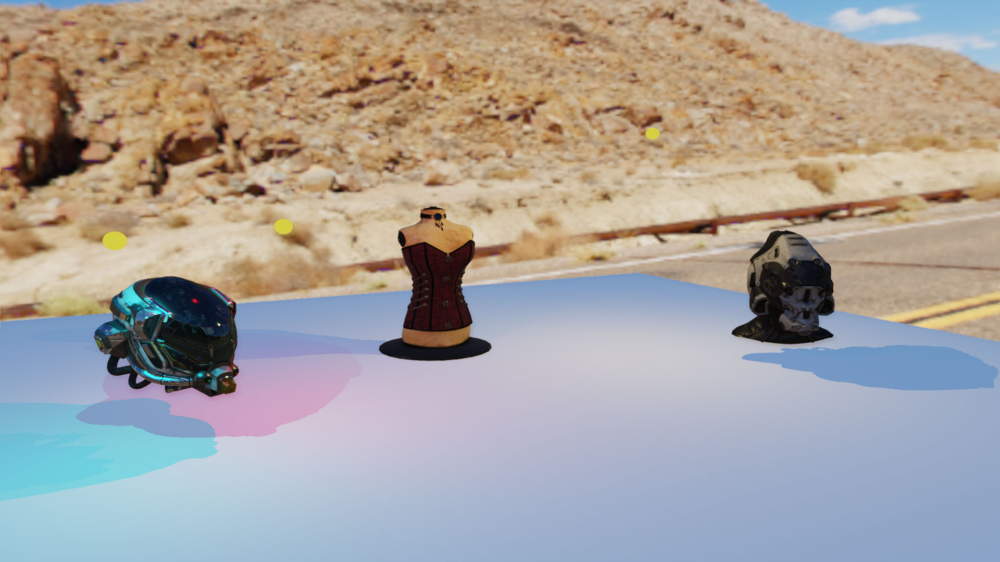
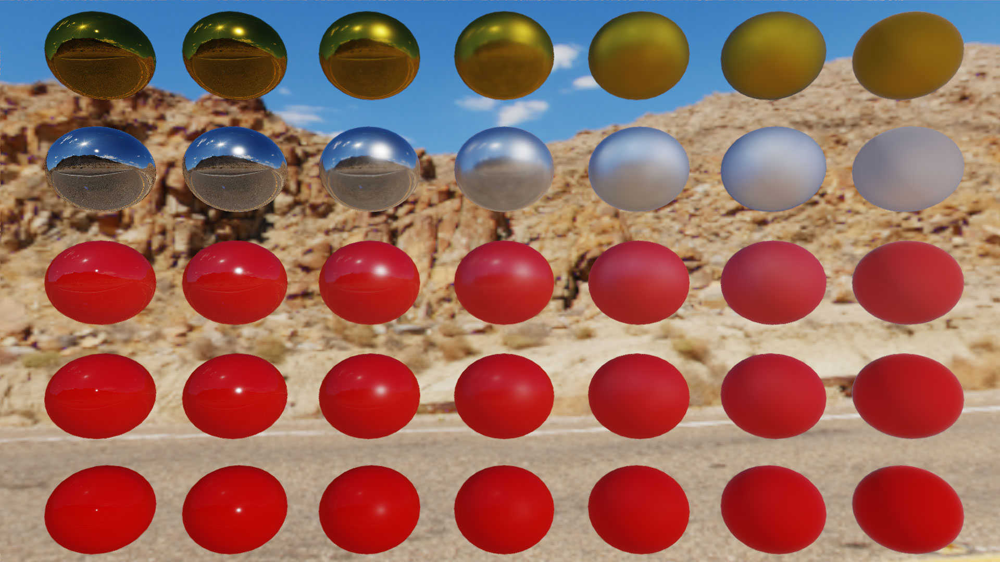
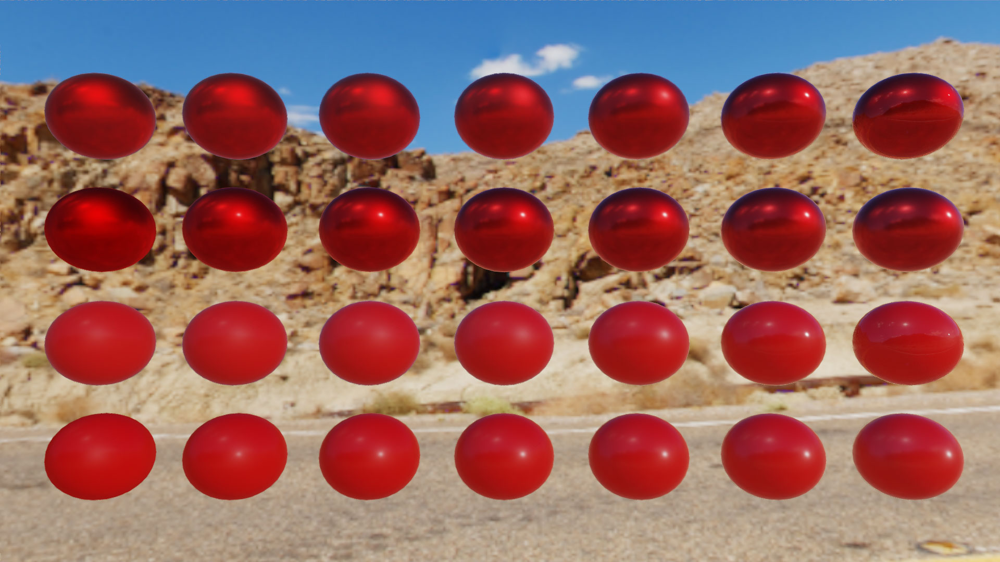
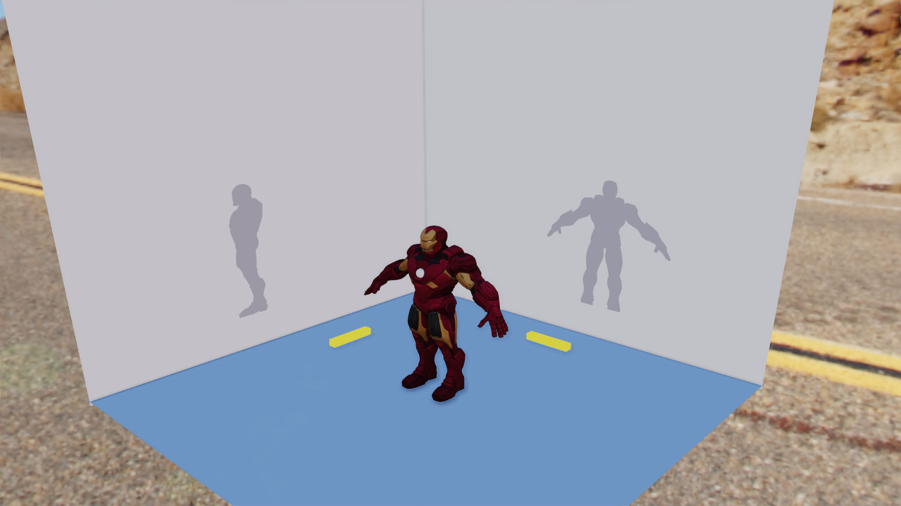
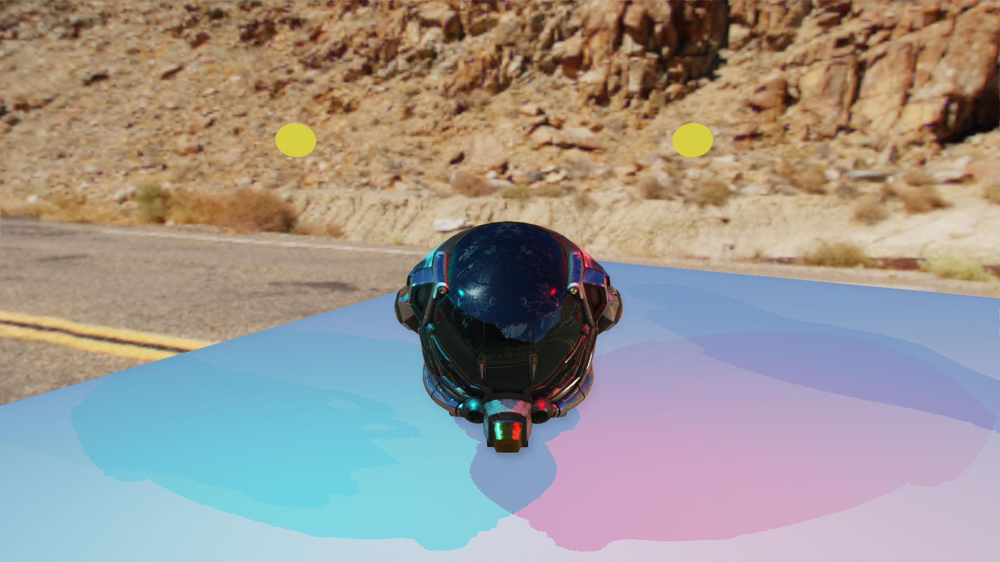
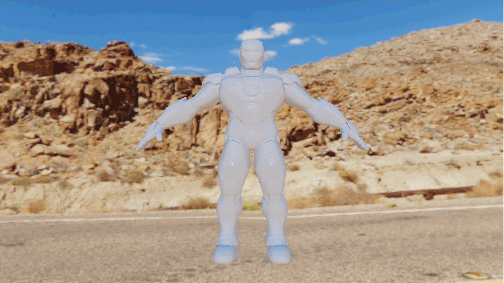

# LuxUmbra -  Light & Shadow Engine

LuxUmbra is a light & shadow engine that runs with Vulkan API. 
The project's goals were to learn **Vulkan API** and modern rendering techniques like **Phisically Based-Rendering** (PBR) and **Post-Process** effects. We did not focus on performances.

It was develop in one month in a group of two people. 

## Table of Contents

+ [How to launch](#How-to-Launch)
+ [Controls](#Controls)
+ [Illumination Model](#Illumination-Model)
+ [Shadows](#shadows)
+ [Image Based-Lighting](#Image-Based-Lighting)
+ [Post Process & Anti-Aliasing](#Post-Proscess-&-Anti-Aliasing)
+ [References](#References)
+ [Shaders Hot Reload](#Shaders-Hot-Reload)

 

## **How to Launch**

+ ### Run Executable

> Extract "LuxUmbra_Binary.rar" archive and run "LuxUmbra.exe"

+ ### Compile the project

> Open "LuxUmbra.sln" solution file. You may need to retarget the project. Compile and run the project.

 

## **Controls**

+ W : forward
+ S : backward
+ A : left
+ D : right
+ E : up
+ C/Alt : down
+ I : show/hide editor
+ Echap : exit

 

## **[WIP] Illumination Model**

### ***Diffuse***

We implemente two different BRDFs for the diffuse term. We have the **Lambertian BRDF** that assumes a uniform diffuse reponse. And we have **Disney's diffuse BRDF** (by Burley) that take the roughness in account to create reflection at grazing angles. In the engine we use Disney's BRDF by default.

### ***Specular***

For the specular part, we implement **Cook-Torrance BRDF**. The different terms of the BRDF that we choose are:

+ **GGX (Trowbridge-Reitz)** for the Normal Distribution Function
+ **Schlick Approximation** for the Fresnel Equation
+ **Smith GGX** for the Masking-Shadowing Function

 

### ***Clear Coat***

We implement a simplified version of material layering with a **Cleat Coat**. It is calculated with the same Cook-Torrance BRDF but with different terms:

+ **GGX** for the Normal Distributon Function
+ **Schlick Approximation** for the Fresnel Equation
+ **Kelement** for the Masking-Shadowing Function

 

### ***Material***

5 different maps are handle: Albedo, Normal, Roughness, Metallic and Ambient Occlusion that allow us to have complex material. 

 

## **[WIP] Shadows**
Description Work-In-Progress

   

## **Image Based-Lighting**

Environment map are from HDR texture and we use it to do **Image-Based Lighing**.  

### **Diffuse Irradiance**

The diffuse part of IBL is achieved by compute the irradiance of the environment map by convolution. The result irradiance is store in a cubemap. This is our **irradience map**.

### **Specular**

Specular part is calculated with the split sum approximation by Epic Games. The first sum is pre-calculated for different roughness values and the results are store in the mip-map levels of a cubemap. This is our **prefiltered map**. The second sum is a 2D LUT that represents the BRDF's responce given an input roughness and an input angle between the normal and the light direction.  

Objet that use IBL reflection sample the prefiltered map using its roughness value to access mip level of the map. Higher mip levels are blurier than lower mip levels. So rough material have blured reflection and smooth material have sharp reflection. 

This two maps depending on the environment map, we compute then at program startup with **compute shader** 

 

## **Post Proscess & Anti-Aliasing**

### **Anti-Aliasing**

We have two anti-alliasing technique. The first one is the **Multisampling Anti-Aliasing** (MSAA) on the vulkan side. We are up to four samples per pixels. We also have **Fast Approximate Anti-Aliasing** (FXAA) as a post process to smooth edge.

 

### **Post-Process**

We have several **Tone Mapping algorithms**, Reinhard, ACES Film and Uncharted2. The tone mapping is to remap HDC color to LDC color. All our color calculations are done in linear color space. We do gamma correction on post-process. 
The last but not least post-process is **Screen-Space Ambient Occlusion** (SSAO). We have a part of deferred rendering. We use normal and position buffer to calculate ambient occlusion of the fragment. 

 

## **References**

### *Rendering*

+ [Real shading in Unreal Engine 4](https://cdn2.unrealengine.com/Resources/files/2013SiggraphPresentationsNotes-26915738.pdf) by Brian Karis, Epic Games, Siggraph 2013 presentation note
+ [Moving Frostbite to Physically Based Rendering 3.0](https://seblagarde.files.wordpress.com/2015/07/course_notes_moving_frostbite_to_pbr_v32.pdf) by Sébastien Lagarde and Charles de Rousiers, Electronic Arts, Siggraph 2014
+ [Real-time Physiccaly Based Rendering](https://en.ppt-online.org/378584) by Yoshiharu Gotanda and Tatsuya Shoji, R&D Repartment, tri-Ace, Inc.
+ [Enterprise PBR Shading Model](https://dassaultsystemes-technology.github.io/EnterprisePBRShadingModel/user_guide.md.html) by Dassault Systèmes for general references about PBR and shading
+ [Filament project](https://google.github.io/filament/Filament.md.html) by Google for general references about PBR and shading
+ [Filament Crafting Physiccaly-Based Materials](https://google.github.io/filament/Material%20Properties.pdf) for material references
+ [Brian Karis's blog](https://graphicrants.blogspot.com/2013/08/specular-brdf-reference.html) for Specular BRDF Reference
+ [A Simple and Practical Approach to SSAO](https://www.gamedev.net/articles/programming/graphics/a-simple-and-practical-approach-to-ssao-r2753/) for an explanation of the SSAO algorithm
+ [Daniel-Alin Loghin's blog](http://alinloghin.com/articles/compute_ibl.html) for IBL resources calculation
+ [Simon Rodriguez's blog](http://blog.simonrodriguez.fr/articles/30-07-2016_implementing_fxaa.html) for an explanation of the FXAA algorithm

### *Vulkan*

+ [Sascha Willems GitHub repository](https://github.com/SaschaWillems/Vulkan) for general references about Vulkan API
+ [NVIDIA Vulkan Shader Resource Binding blog post](https://developer.nvidia.com/vulkan-shader-resource-binding) for optimizing resource bindings by updated them based on usage frequency

 

## **Shaders Hot Reload**

1. Makes change to shaders
2. Run LuxUmbra/data/shaders/Compilers.bat
3. Click on "Reload Shader" button on editor
