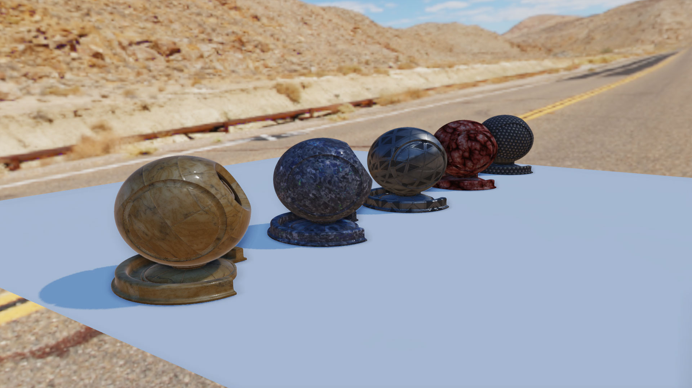
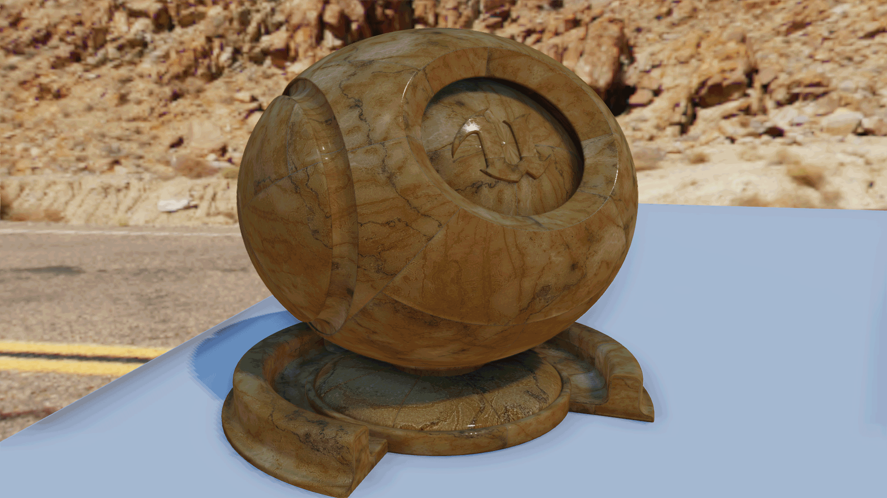

# LuxUmbra -  Light & Shadow Engine

LuxUmbra is a light & shadow engine that runs with Vulkan API. 
The project's goals were to learn **Vulkan API** and modern rendering techniques like **Physically Based-Rendering** (PBR) and **Post-Process** effects. We did not focus on performances and optimization.

It was developed in one month in a group of two people. 

## Table of Contents

+ [How to launch](#How-to-Launch)
+ [Controls](#Controls)
+ [Editor](#Editor)
+ [Shaders Hot Reload](#Shaders-Hot-Reload)
+ [Technical Document](#Technical-Document)
  + [Illumination Model](#Illumination-Model)
  + [Shadows](#shadows)
  + [Image Based-Lighting](#Image-Based-Lighting)
  + [Post Process & Anti-Aliasing](#Post-Proscess-&-Anti-Aliasing)
  + [References](#References)

 

## **How to Launch**

+ ### Run Executable

> Extract "LuxUmbra_Binary.rar" archive and run "LuxUmbra.exe"

+ ### Compile the project

> Open "LuxUmbra.sln" solution file. You may need to re-target the project. Compile and run the project.

 

## **Controls**

+ W : forward
+ S : backward
+ A : left
+ D : right
+ E : up
+ C/Alt : down
+ I : show/hide editor
+ Echap : exit

 

## **Editor**

+ **Change Scenes:** Change the current scene by click on the radio butons at the top of the editor.
+ **Post-Process:**
  + *Debug:* Show tone mapping, FXAA, SSAO or direct color only on the left part of the screen. The "percent" slider allows moving the white line that split the screen.
  + *Tone Mapping:* Expose the tone mapping algorithm and the exposure factor.
  + *FXAA:* Expose the overall FXAA quality.
  + *SSAO:* Expose SSAO settings.
+ **Render Settings:** Expose shadow mapping parameters.
+ **Scenes:**  Expose camera, meshes, lights and materials properties.

 

## **Shaders Hot Reload**

1. Make changes to shaders
2. Run LuxUmbra/data/shaders/Compilers.bat
3. Click on "Reload Shader" button on editor

 

## **Technical Document**

### **Illumination Model**

All the calculation for illumination are done in **"cameraSpaceLight.frag"** shader.

#### **Diffuse**

We implemented two different BRDFs for the diffuse term. We have the **Lambertian BRDF** that assumes a uniform diffuse response. And we have **Disney's diffuse BRDF** (by Burley) that take the roughness in account to create reflection at grazing angles. In the engine, we use Disney's BRDF by default.

#### **Specular**

For the specular part, we implemented **Cook-Torrance BRDF**. The different terms of the BRDF that we choose are:

+ **GGX (Trowbridge-Reitz)** for the Normal Distribution Function
+ **Schlick Approximation** for the Fresnel Equation
+ **Smith GGX** for the Masking-Shadowing Function

<ins>**Figure 1:**</ins> different roughness, reflectance and metalness values

 

#### **Clear Coat**

We implemented a simplified version of material layering with a **Cleat Coat**. It is calculated with the same Cook-Torrance BRDF but with different terms:

+ **GGX** for the Normal Distributon Function
+ **Schlick Approximation** for the Fresnel Equation
+ **Kelement** for the Masking-Shadowing Function

<ins>**Figure 2:**</ins> different cleat coat roughness and intensity values

 

#### **Material**

5 different maps are handled: Albedo, Normal, Roughness, Metallic and Ambient Occlusion that allow us to have complex material. 

<ins>**Figure 3:**</ins> collection of complex physically based materials

<ins>**Figure 4:**</ins> marble material with and without clear coat

 

### **[WIP] Shadows**
Description Work-In-Progress

<ins>**Figure 5:**</ins> model is illuminated by two directional lights that produce shadows on the walls

   

### **Image Based-Lighting**

Our environment maps are from HDR textures and we use them to do **Image-Based Lighting**.  

#### **Diffuse Irradiance**

The diffuse part of IBL is achieved by computing the irradiance of the environment map by convolution. This result is stored in a cubemap. This is our **irradiance map**.

#### **Specular**

Specular part is calculated with the split sum approximation made famous by Epic Games. The first sum is pre-calculated for different roughness values and the results are stored in the mip-map levels of a cubemap. This is our **prefiltered map**. The second sum is a 2D LUT that represents the BRDF's responce given an input roughness and an input angle between the normal and the light direction.  

Objet that use IBL reflection sample the prefiltered map using its roughness value to access mip level of the map. Higher mip levels are blurrier than lower mip levels. So rough material have blurred reflection and smooth material have sharp reflection. 

This two maps depending on the environment map, we compute them at program startup with **compute shader** 

<ins>**Figure 6:**</ins> the environment is reflected off the helmet

 

### **Post-Proscess & Anti-Aliasing**

All the calculation for post-processing are done in **"blit.frag"** shader.

#### **Anti-Aliasing**

We implemented two anti-aliasing techniques. The first one is the **Multisampling Anti-Aliasing** (MSAA) on the vulkan side. We are up to four samples per pixels. We also implemented **Fast Approximate Anti-Aliasing** (FXAA) as a post-process to smooth edge.

#### **Post-Process**

We implemented several **Tone Mapping algorithms**, Reinhard, ACES Film and Uncharted2. The tone mapping remaps HDC color to LDC color. All our color calculations are done in linear color space. We do gamma correction on post-process. 
The last post-process that we implemented is **Screen-Space Ambient Occlusion** (SSAO). We have a part of deferred rendering. We use normal and position buffer to calculate ambient occlusion of the fragment and apply this occlusion during the post-process pass. 

<ins>**Figure 7:**</ins> same image with and without SSAO

 

### **References**

#### *Rendering*

+ [Real shading in Unreal Engine 4](https://cdn2.unrealengine.com/Resources/files/2013SiggraphPresentationsNotes-26915738.pdf) by Brian Karis, Epic Games, Siggraph 2013 presentation note
+ [Moving Frostbite to Physically Based Rendering 3.0](https://seblagarde.files.wordpress.com/2015/07/course_notes_moving_frostbite_to_pbr_v32.pdf) by Sébastien Lagarde and Charles de Rousiers, Electronic Arts, Siggraph 2014
+ [Real-time Physiccaly Based Rendering](https://en.ppt-online.org/378584) by Yoshiharu Gotanda and Tatsuya Shoji, R&D Repartment, tri-Ace, Inc.
+ [Enterprise PBR Shading Model](https://dassaultsystemes-technology.github.io/EnterprisePBRShadingModel/user_guide.md.html) by Dassault Systèmes for general references about PBR and shading
+ [Filament project](https://google.github.io/filament/Filament.md.html) by Google for general references about PBR and shading
+ [Filament Crafting Physiccaly-Based Materials](https://google.github.io/filament/Material%20Properties.pdf) for material references
+ [Brian Karis's blog](https://graphicrants.blogspot.com/2013/08/specular-brdf-reference.html) for Specular BRDF Reference
+ [A Simple and Practical Approach to SSAO](https://www.gamedev.net/articles/programming/graphics/a-simple-and-practical-approach-to-ssao-r2753/) for an explanation of the SSAO algorithm
+ [Daniel-Alin Loghin's blog](http://alinloghin.com/articles/compute_ibl.html) for IBL resources calculation
+ [Simon Rodriguez's blog](http://blog.simonrodriguez.fr/articles/30-07-2016_implementing_fxaa.html) for an explanation of the FXAA algorithm

### *Vulkan*

+ [Sascha Willems GitHub repository](https://github.com/SaschaWillems/Vulkan) for general references about Vulkan API
+ [NVIDIA Vulkan Shader Resource Binding blog post](https://developer.nvidia.com/vulkan-shader-resource-binding) for optimizing resource bindings by updated them based on usage frequency
